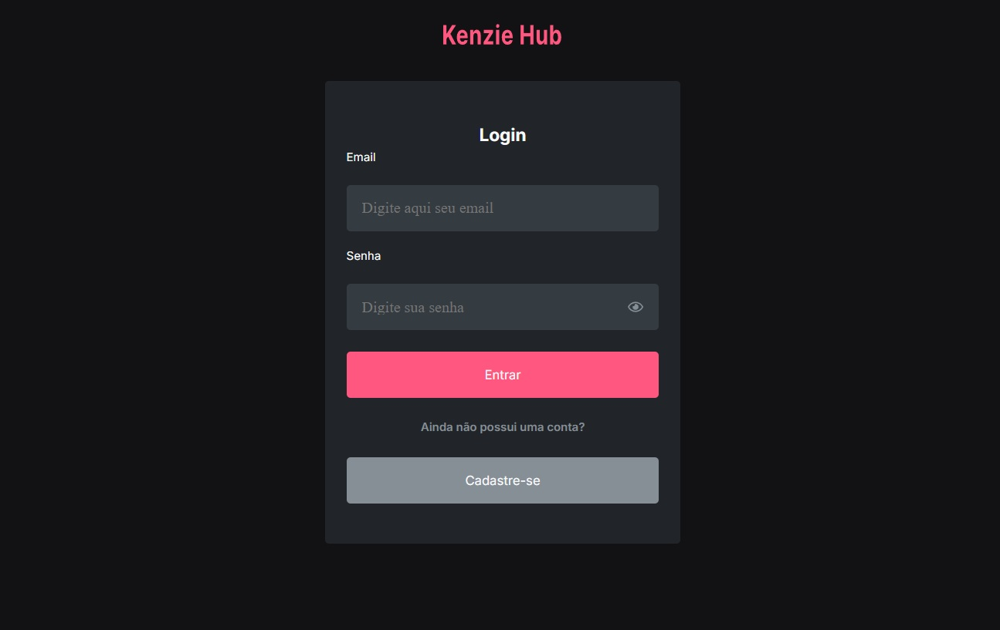
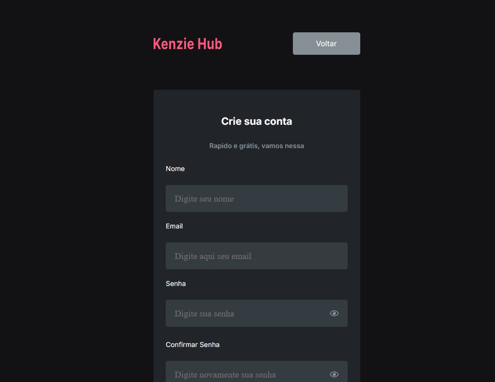
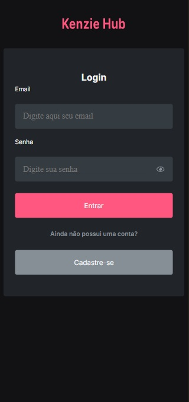

# 🔐 Kenzie Hub - Parte 1: Cadastro e Login

Este projeto foi desenvolvido como parte do curso da Kenzie Academy com o objetivo de consolidar os conhecimentos de formulários, rotas e integração com APIs em aplicações React.

---

## 🧾 Descrição

Nesta primeira etapa do Kenzie Hub, foram implementadas funcionalidades de:

- Cadastro de novo usuário;
- Login e logout com controle de autenticação;
- Validação de formulários;
- Gerenciamento de estado de autenticação;
- Navegação protegida entre páginas.

O layout segue fielmente o style guide fornecido no Figma.

---

## 🚀 Tecnologias Utilizadas

- React
- React Router DOM
- React Hook Form
- Zod (validações)
- Axios
- Sass / CSS Modules
- Tostify (notificação)

---

## 🗺️ Rotas da Aplicação

| Rota         | Componente      | Descrição                          |
| ------------ | --------------- | ---------------------------------- |
| `/`          | `LoginPage`     | Página de login                    |
| `/register`  | `RegisterPage`  | Página de cadastro                 |
| `/dashboard` | `DashboardPage` | Página principal do usuário logado |

---

## 📋 Funcionalidades

### ✅ Cadastro

- Rota: `POST /users`
- Campos validados com `Zod`:
  - `name` (obrigatório)
  - `email` (obrigatório e e-mail válido)
  - `password` (mínimo 8 caracteres, 1 maiúscula, 1 minúscula e 1 número)
  - `confirmPassword` (igual à senha)
  - `bio` (obrigatório)
  - `contact` (obrigatório)
  - `course_module` (obrigatório)
- Redirecionamento para login após sucesso.

### ✅ Login

- Rota: `POST /sessions`

- Campos validados com `Zod`:

  - `name` (obrigatório)
  - `password` (obrigatório)

- Armazena:
  - Usuário no estado global (idealmente em `RoutesMain`)
  - Token no `localStorage` com a chave `"@TOKEN"`
- Redirecionamento automático para `/dashboard`

### 🚪 Logout

- Remove token e usuário do estado/localStorage
- Redireciona para `/`

---

## 🖼️ Capturas de Tela

### 💻 Versão Desktop




### 📱 Versão Mobile

## 

## 🖥️ Clonar o Projeto

1. Clone o repositório:

   ```bash
   git clone https://github.com/dkrausz/hub-kenzie.git
   ```

2. Abra a pasta do projeto:

   ```bash
    cd hub-kenzie
   ```

3. Execute o comando

   ```bash
    npm run dev
   ```

## 🔗 Acesso ao Projeto

- Repositório GitHub: [https://github.com/dkrausz/hub-kenzie](https://github.com/dkrausz/hub-kenzie)
- Vercel Page: [https://react-entrega-kenzie-hub-dkrausz-lg0cxduhv.vercel.app/](https://react-entrega-kenzie-hub-dkrausz-lg0cxduhv.vercel.app/)

---

## 📝 Licença

Este projeto é de uso educacional e não possui uma licença específica.
